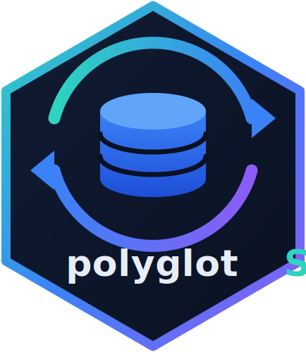

<!-- README.md is generated from README.Rmd. Please edit that file -->

```{r, include = FALSE}
knitr::opts_chunk$set(
  collapse = TRUE,
  comment = "#>",
  fig.path = "man/figures/README-",
  out.width = "100%"
)
```

# polyglotSQL 

<!-- badges: start -->
[](https://github.com/milkway/polyglot-sql-r/actions/workflows/R-CMD-check.yaml)
[](https://github.com/milkway/polyglot-sql-r/actions/workflows/pkgdown.yaml)
[](https://app.codecov.io/gh/milkway/polyglot-sql-r)
[](https://opensource.org/license/mit)
<!-- badges: end -->

polyglotSQL parses, tokenizes, validates, formats, analyzes and **translates
SQL between 30+ dialects** — PostgreSQL, MySQL, BigQuery, Snowflake, DuckDB,
SQLite, T-SQL, Oracle, ClickHouse, Trino, Spark and many more — directly from
R. It embeds the [polyglot-sql](https://github.com/tobilg/polyglot) Rust crate
(a Rust port of the excellent [SQLGlot](https://github.com/tobymao/sqlglot)
Python library), so everything runs natively in-process: no Python, no Java,
no database connection, no network calls.

## Why polyglotSQL?

Analytics teams rarely live in a single SQL dialect. Warehouses migrate
(Redshift → Snowflake, anything → DuckDB), pipelines target several engines at
once, and auditing queries requires understanding them structurally, not as
strings. polyglotSQL gives R a real SQL compiler front-end: a proper parser,
an AST, dialect-aware generators, column-level lineage and structural
analysis.

How it compares to related R packages:

| Package | What it does | How polyglotSQL differs |
|---|---|---|
| [SqlRender](https://cran.r-project.org/package=SqlRender) | OHDSI templating + rule-based translation from its own SQL flavor (Java) | polyglotSQL parses *any* dialect into an AST and regenerates it; no Java, no template markup |
| [SQLFormatteR](https://github.com/dataupsurge/SQLFormatteR) | SQL formatting | formatting is one of a dozen polyglotSQL features |
| sqlfluffr | wrapper around the Python `sqlfluff` linter | polyglotSQL needs no Python; validation comes from a native parser |
| [dbplyr](https://cran.r-project.org/package=dbplyr) | generates SQL *from dplyr code* per backend | polyglotSQL starts from *existing SQL* and translates/analyzes it |

## Installation

Binaries built by CI need no Rust toolchain. Installing **from source**
requires Rust (cargo and rustc >= 1.88):

```sh
# install Rust once, via rustup:
curl --proto '=https' --tlsv1.2 -sSf https://sh.rustup.rs | sh
```

Then:

```r
# install.packages("remotes")
remotes::install_github("milkway/polyglot-sql-r")
```

The package builds fully offline: all Rust dependencies are vendored in the
source tarball and nothing is downloaded during `R CMD INSTALL`.

## Transpile SQL between dialects

```{r transpile}
library(polyglotSQL)

sql_transpile(
  "SELECT IFNULL(a, b) FROM t",
  from = "mysql",
  to = "postgres"
)

sql_transpile(
  "SELECT TOP 5 name, GETDATE() FROM users",
  from = "tsql",
  to = "duckdb"
)
```

By default unsupported constructs raise a classed error
(`unsupported = "raise"`); use `"warn"` or `"ignore"` to force best-effort
output.

## Format

```{r format}
cat(sql_format("select id,sum(x) total from t where y=1 group by id"))
```

## Parse and inspect

```{r parse}
ast <- sql_parse("SELECT a, b FROM t WHERE x = 1")
ast

sql_tokenize("SELECT a FROM t")
```

## Validate

```{r validate}
sql_validate("SELECT FROM WHERE")

sql_validate(
  "SELECT nonexistent FROM t",
  schema = list(t = c(id = "INT", name = "TEXT"))
)
```

## Column-level lineage

```{r lineage}
sql_lineage(
  "WITH base AS (SELECT id, amount FROM payments)
   SELECT id, amount * 2 AS doubled FROM base"
)
```

## Supported dialects

```{r dialects}
sql_dialects()
```

## Semantic limitations

Transpilation is **syntactic and best-effort**. Two engines can accept the
same query text and still disagree about implicit casts, collations, `NULL`
ordering, integer division, time zones, or function edge cases. polyglotSQL
(like SQLGlot) does not emulate engine semantics.

> **Always test transpiled SQL against the target database before relying on
> it in production.**

## Acknowledgements and licensing

polyglotSQL (MIT) statically links the
[polyglot-sql](https://github.com/tobilg/polyglot) crate by Tobias Müller
(MIT), which derives from [SQLGlot](https://github.com/tobymao/sqlglot) by
Toby Mao (MIT). Licenses of all vendored Rust crates are collected in
[`inst/COPYRIGHTS`](https://github.com/milkway/polyglot-sql-r/blob/main/inst/COPYRIGHTS).
